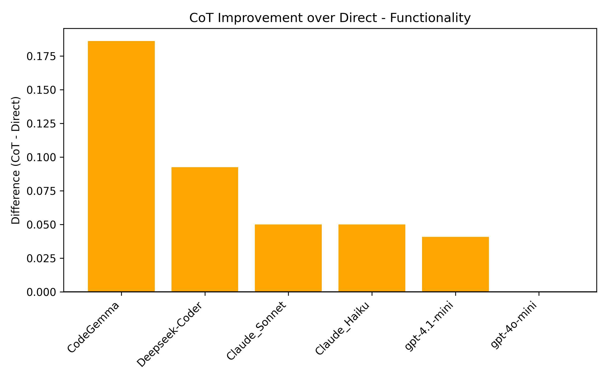
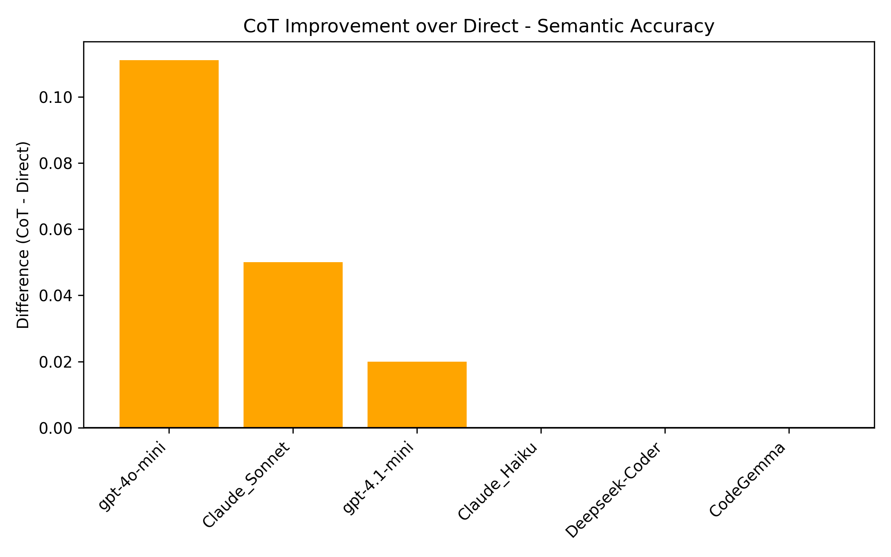
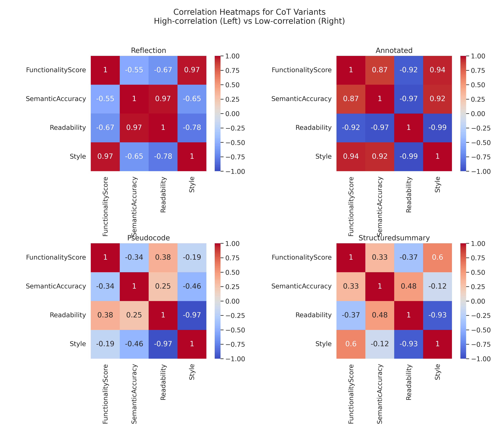
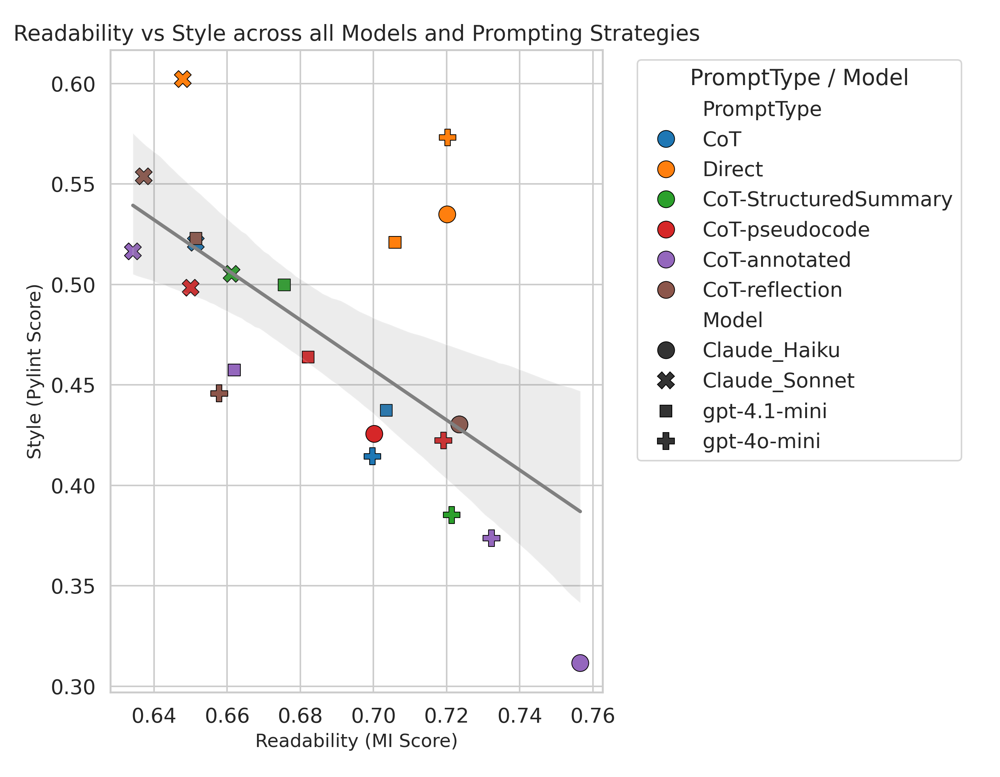

# LLM-based Java-to-Python Code Translation

MSc final project exploring whether Chain-of-Thought (CoT) prompting improves LLM-based code translation from Java to Python.

The project compares direct prompting, basic CoT prompting, and several CoT variants across local and API-based LLMs. It also includes an automated evaluation pipeline for syntax, functionality, semantic accuracy, readability, and Python style.

## Project Focus

LLMs can often generate code that looks plausible but fails to preserve logic, runtime behaviour, or coding conventions. This project studies that problem in Java-to-Python translation using Project CodeNet, with a focus on whether extra reasoning steps help or interfere with translation quality.

The core finding is that CoT prompting is not universally better. It can improve translation quality for models that benefit from external reasoning, but advanced models with stronger internal reasoning may perform worse when forced through redundant reasoning steps. The best prompting strategy depends on the model, the metric being optimised, and the desired trade-off between correctness and maintainability.

## What This Repository Contains

- Translation scripts for direct prompting and CoT prompting.
- CoT variant experiments, including structured summary, pseudocode, annotated code, and reflection prompts.
- Evaluation scripts for syntax, functionality, semantic accuracy, readability, and coding style.
- Analysis scripts for cross-model and cross-prompt comparison.
- Result figures extracted from the MSc dissertation.

## Methods

### Dataset

The project uses IBM's Project CodeNet dataset for Java-to-Python translation experiments.

- Source language: Java
- Target language: Python
- Filtered dataset: accepted Java submissions only
- Filtered pool: around 17,200 Java submissions across 242 problems
- API model batch size: 164 files, inspired by the HumanEval task count
- Local model batch size: 50 files due to local GPU and runtime constraints

Python reference submissions were not used as the primary comparison target. The evaluation compares generated Python translations against the original Java source code and its observed behaviour.

### Models Evaluated

| Category | Models |
| --- | --- |
| Local models | Deepseek-Coder 6.7B-Instruct, CodeGemma 7B-IT |
| API-based models | GPT-4.1-mini, GPT-4o-mini, Claude 3.5 Haiku, Claude 4 Sonnet |

### Prompting Strategies

| Strategy | Description |
| --- | --- |
| Direct | Translate Java source code directly into Python. |
| Basic CoT | Generate a step-by-step explanation before translation. |
| Structured Summary | Summarise input, output, data structures, and key logic before translation. |
| Pseudocode | Convert Java logic into pseudocode before producing Python. |
| Annotated Code | Add explanatory inline comments to Java before translation. |
| Reflection | Translate with CoT, then ask the model to review and improve the translation. |

### Evaluation Pipeline

| Metric | Implementation |
| --- | --- |
| Syntactic correctness | Python `ast` parsing |
| Functionality | Generated/cached test cases executed against Java and translated Python |
| Semantic accuracy | LLM-based Java/Python logic comparison |
| Readability | Radon Maintainability Index |
| Style | Pylint score against Python style conventions |

## Key Results

### Direct vs CoT, Normalised Scores

| Model | Syntax CoT | Syntax Direct | Functionality CoT | Functionality Direct | Semantic CoT | Semantic Direct |
| --- | ---: | ---: | ---: | ---: | ---: | ---: |
| Claude 3.5 Haiku | 1.00 | 1.00 | 0.85 | 0.80 | 1.00 | 1.00 |
| Claude 4 Sonnet | 1.00 | 1.00 | 0.85 | 0.80 | 0.90 | 0.85 |
| GPT-4.1-mini | 1.00 | 1.00 | 0.92 | 0.88 | 0.88 | 0.86 |
| GPT-4o-mini | 1.00 | 1.00 | 0.89 | 0.89 | 0.89 | 0.78 |
| Deepseek-Coder | 0.87 | 0.92 | 0.70 | 0.61 | 1.00 | 1.00 |
| CodeGemma | 0.86 | 0.92 | 0.68 | 0.59 | 1.00 | 1.00 |

| Model | Readability CoT | Readability Direct | Style CoT | Style Direct |
| --- | ---: | ---: | ---: | ---: |
| Claude 3.5 Haiku | 0.72 | 0.72 | 0.43 | 0.53 |
| Claude 4 Sonnet | 0.65 | 0.65 | 0.52 | 0.60 |
| GPT-4.1-mini | 0.70 | 0.71 | 0.44 | 0.52 |
| GPT-4o-mini | 0.70 | 0.72 | 0.41 | 0.57 |
| Deepseek-Coder | 0.62 | 0.58 | 0.79 | 0.85 |
| CodeGemma | 0.61 | 0.57 | 0.78 | 0.84 |

Main observations:

- CoT improved functionality for most tested models, especially local models.
- GPT-4o-mini showed a strong semantic accuracy gain under CoT while maintaining functionality.
- CoT often reduced Pylint style scores, showing a trade-off between reasoning-driven translation and style compliance.
- There is no single best prompting strategy across all models and all metrics.

## Result Graphs

### CoT Improvement Over Direct Prompting





Direct links:

- [Functionality delta](assets/results/functionality_diff_pos_neg.png)
- [Semantic accuracy delta](assets/results/semantic_accuracy_diff_pos_neg.png)
- [Syntax delta](assets/results/syntax_diff_pos_neg.png)
- [Readability delta](assets/results/readability_diff_pos_neg.png)
- [Style delta](assets/results/style_diff_pos_neg.png)

### CoT Variant Correlations

Reflection and annotated-code prompting produced stronger inter-metric correlations, while pseudocode and structured-summary prompting produced looser, more flexible behaviour.



### Readability vs Style Trade-off

Across models and prompting strategies, readability and style showed a consistent negative relationship. This suggests that code translation quality should be evaluated across multiple dimensions rather than reduced to one score.



## Repository Structure

```text
.
|-- Deepseek-Coder_6.7B-Instruct/
|-- gpt-4.1-mini/
|-- gpt-4o-mini/
|-- combine_models_results/
|-- assets/results/
|-- requirement.txt
`-- README.md
```

Each model folder follows the same general workflow:

```text
batch_translation.py             # Selects Java files and runs translation
translation.py                   # Defines direct and CoT translation prompts
evaluate_syntax.py               # Checks Python syntax using ast
evaluate_functionality.py        # Runs Java/Python behavioural tests
evaluate_semantic.py             # Uses LLM judgment for semantic preservation
evaluate_readability.py          # Computes Radon Maintainability Index
evaluate_style.py                # Computes Pylint style score
evaluate_summary.py              # Aggregates and plots normalised metrics
```

## Setup

Install dependencies:

```bash
pip install -r requirement.txt
```

For API-based models, create a `.env` file inside the relevant model folder:

```env
OPENAI_API_KEY=your_openai_api_key_here
ANTHROPIC_API_KEY=your_anthropic_api_key_here
```

Download Project CodeNet Java data and place it at:

```text
../codenet_project/Project_CodeNet_Java250
```

The scripts expect Project CodeNet problem descriptions and metadata to be available locally for test-case generation and evaluation.

## Usage

Run translation for a model folder:

```bash
python batch_translation.py
```

Run the evaluation stages:

```bash
python evaluate_syntax.py
python evaluate_functionality.py
python evaluate_semantic.py
python evaluate_readability.py
python evaluate_style.py
python evaluate_summary.py
```

For CoT variants, run the corresponding variant scripts such as:

```bash
python batch_translation_CoT_annotated.py
python evaluate_functionality_CoT_annotated.py
python evaluate_summary_CoT_annotated.py
```

Combine cross-strategy results where supported:

```bash
python combine_results_CoT_variants.py
```

## Limitations

- The full filtered CodeNet set was not evaluated because of API cost and local hardware limits.
- Semantic accuracy is judged by an LLM rather than by manual expert review.
- Model scale, alignment method, and prompting behaviour are not fully isolated variables.
- Generated test cases improve coverage but are not a substitute for official benchmark tests.

## Skills Demonstrated

- LLM evaluation and prompt engineering
- Java-to-Python code translation workflows
- Automated code-quality evaluation
- Test-case generation and behavioural validation
- Python data processing and visual analysis
- Local model experimentation and API-based model comparison
